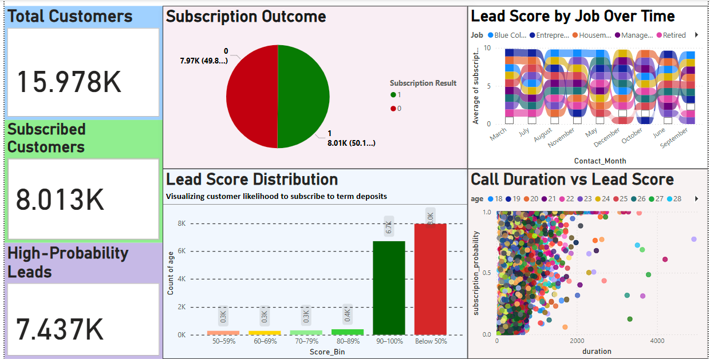

# 📊 Bank Marketing Campaign Prediction ( ETL | Python | Power BI )

This Project predicts customer subscription to term deposits using a Portuguese bank's marketing data.  
It includes Python machine learning, SHAP explainability, and a Power BI dashboard.

This project combines **machine learning** and **business intelligence** to predict whether customers will subscribe to a term deposit based on direct marketing campaign data from a Portuguese bank. 

It leverages **Python modeling** and a **Power BI dashboard** to deliver clear, actionable business insights.

---

## 🚀 Project Objectives

- Predict term deposit subscription likelihood using historical campaign data.
- Handle data imbalance using SMOTE to improve model performance.
- Train and evaluate Logistic Regression, Random Forest, and XGBoost models.
- Explain model behavior using SHAP values.
- Visualize results with an interactive Power BI dashboard.

---

## 🧱 Dataset Overview

**Source**: UCI Machine Learning Repository  
- Size: ~41,000 records  
- Target Variable: `y` (1 = subscribed, 0 = not subscribed)  

### `Key Features:`
- `Demographics`: age, job, education, marital status  
- `Campaign interaction`: contact month, number of contacts, call duration  
- `Economic context`: employment rate, consumer index  

### **Dimension Tables**  
- `dim_time`: Time attributes (date, month, year)  
- `dim_stock`: Stock tickers and company mapping  
- `dim_company`: Company names and ticker info  
- `dim_index`: Market index info and volumes  

---

## 🧠 Tech Used

- `Language`: Python (Google Colab)  
- `ML Libraries`: pandas, scikit-learn, XGBoost, SHAP, imblearn  
- `BI Tool`: Microsoft Power BI  
- `Other Tools`: Matplotlib, Seaborn, SMOTE, Joblib  

---

### 🧠 Modeling Approach

- **Preprocessing**: Removed `unknown`, one-hot encoded categoricals  
- **Feature Engineering**: Added `subscription_probability`, `score_bin`  
- **Model Training**:
  - Logistic Regression  
  - Random Forest  
  - XGBoost ✅ Best performance  
- **Explainability**: SHAP beeswarm plot

- The complete analysis, insights, and business recommendations are available in the PDF below:

📥 [PORTUGUESE Bank Marketing Prediction.pdf](PORTUGUESE%20Bank%20Marketing%20Prediction.pdf)


# 📈 Bank Marketing Campaign Dashboard

[🔗 **View Live Dashboard**](https://app.powerbi.com/groups/me/reports/840bcf9f-f6a3-4153-9fa9-cfa6a1bad5ac/23946273c36555284857?experience=power-bi)

---

## 🧠 Problem Statement

This Power BI dashboard offers a deep dive into customer behavior and marketing performance using a **Portuguese Bank Marketing Dataset**. The campaign aimed to encourage customers to subscribe to term deposits.

---

## 💡 Key Business Insights

- ✅ The marketing model effectively identifies **high-probability leads**.
- 📞 **Call duration** plays a crucial role in campaign success.
- 👩‍💼 Certain **job roles** are more responsive during specific months.
- 🎯 The model creates a clear distinction between low and high scoring leads—ideal for **targeted outreach**.
- 📊 Approximately **50% of contacted customers** ended up subscribing.

---

## 🛠️ Steps Followed

### 🔹 Step 1: Creation of Categorical Columns 

Created Categorical Columns from One-Hot Encoded Flags
Original columns: job_blue-collar, job_entrepreneur, job_housemaid, ..., job_unemployed.
Combined into a single Job column using Power Query or DAX.

```DAX
Job = 
SWITCH(TRUE(),
    bank_predictions[job_blue-collar] = TRUE(), "Blue Collar",
    bank_predictions[job_entrepreneur] = TRUE(), "Entrepreneur",
    bank_predictions[job_housemaid] = TRUE(), "Housemaid",
    bank_predictions[job_management] = TRUE(), "Management",
    bank_predictions[job_retired] = TRUE(), "Retired",
    bank_predictions[job_self-employed] = TRUE(), "Self-Employed",
    bank_predictions[job_services] = TRUE(), "Services",
    bank_predictions[job_student] = TRUE(), "Student",
    bank_predictions[job_technician] = TRUE(), "Technician",
    bank_predictions[job_unemployed] = TRUE(), "Unemployed",
    "Unknown"
)

```

---

### 🔹 Step 2: Marital Status
Original columns:
`marital_married`, `marital_single`, Presumed that if both = 0, the person is divorced. Combined into a Marital Status column.

```DAX
Marital_Status = 
SWITCH(TRUE(),
    bank_predictions[marital_married] = TRUE(), "Married",
    bank_predictions[marital_single] = TRUE(), "Single",
    "Divorced"
)

```

---

### 🔹 Step 3: Education Level
Original columns: 
`education_basic.6y`, `education_basic.9y`, `education_high.school`, etc.Combined into a new Education Level column.
```DAX
Education_Level = 
SWITCH(TRUE(),
    bank_predictions[education_basic.6y] = TRUE(), "Basic (6y)",
    bank_predictions[education_basic.9y] = TRUE(), "Basic (9y)",
    bank_predictions[education_high.school] = TRUE(), "High School",
    bank_predictions[education_illiterate] = TRUE(), "Illiterate",
    bank_predictions[education_professional.course] = TRUE(), "Professional Course",
    bank_predictions[education_university.degree] = TRUE(), "University Degree",
    "Unknown"
)

```

---

### 🔹 Step 4: Contact Month
Create a `Contact_Month` Column. Extracted from call or campaign date field. It has been used to track performance across months.
```DAX
Contact_Month = 
SWITCH(TRUE(),
    'bank_data'[month_mar] = 1, "March",
    'bank_data'[month_apr] = 1, "April",
    'bank_data'[month_may] = 1, "May",
    'bank_data'[month_jun] = 1, "June",
    'bank_data'[month_jul] = 1, "July",
    'bank_data'[month_aug] = 1, "August",
    'bank_data'[month_sep] = 1, "September",
    'bank_data'[month_oct] = 1, "October",
    'bank_data'[month_nov] = 1, "November",
    'bank_data'[month_dec] = 1, "December",
    "Unknown"
)
```

---

### 🔹 Step 5: Score Binning
Create a Score Bin for Filtering.
```DAX
Score_Bin =  
SWITCH(TRUE(),
    bank_predictions[subscription_probability] >= 0.9, "90–100%",
    bank_predictions[subscription_probability] >= 0.8, "80–89%",
    bank_predictions[subscription_probability] >= 0.7, "70–79%",
    bank_predictions[subscription_probability] >= 0.6, "60–69%",
    bank_predictions[subscription_probability] >= 0.5, "50–59%",
    "Below 50%")
```

---

## 📊 Dashboard Components

### 🟦 1. KPI Cards

| Metric | Description |
|--------|-------------|
| **Total Customers** | Count of all contacted individuals |
| **Subscribed Customers** | Count of actual = 1 |
| **High-Probability Leads** | Count where `subscription_probability > 0.7` |


---

### 🥧 2. Pie Chart – Subscription Distribution

Displays the percentage of customers who **subscribed vs not subscribed**.


---

### 📶 3. Histogram – Lead Score Distribution

Uses the `Score_Bin` to display **lead probability segments**.


---

### 🏁 4. Ribbon Chart – Lead Score by Job Over Time

Tracks **monthly lead score trends** by job type.

> 💡 *"Retired customers had the highest predicted scores in March & May."*


---

### 📉 5. Scatter Chart – Call Duration vs Lead Score

| **Section** | **Field**                | **Meaning**                                     |
|-------------|--------------------------|-------------------------------------------------|
| X-axis      | `duration`               | How long the last call lasted                   |
| Y-axis      | `subscription_probability` | Model-predicted lead score                      |
| Details     | `age` or `Job`           | To make each point unique                       |
| Tooltips    | `Education_Level`, `actual`, `Job` | Show on hover                                |

> • Each dot represents a customer.  
> • If the dots trend upward as duration increases, **longer calls may lead to better scores**.  
> • If the dots are scattered with no pattern, the **relationship is likely weak**.


> 📌 *Customers with high lead scores (≥0.7) typically had calls >150 seconds.*


---

## 📌 Dashboard Overview (Quick View)

<p align="center">
  
</p>

| Section | Description |
|--------|-------------|
| **Top-Left** | KPI Cards: Total Customers, Subscribed, High-Score Leads |
| **Top-Center** | Pie Chart – Subscription Breakdown |
| **Top-Right** | Ribbon Chart – Lead Score by Job & Month |
| **Bottom-Center** | Histogram – Subscription Score Distribution |
| **Bottom-Right** | Scatter Plot – Call Duration vs Lead Score |

---

## ✅ Final Takeaways

- 🧠 The model and visuals support **data-driven targeting**.
- 📅 Time of year and job roles significantly affect subscription success.
- 📞 Encourage **longer, more meaningful calls** for better outcomes.
- 📍 Dashboard helps marketing teams focus on **high-conversion profiles**.

---
